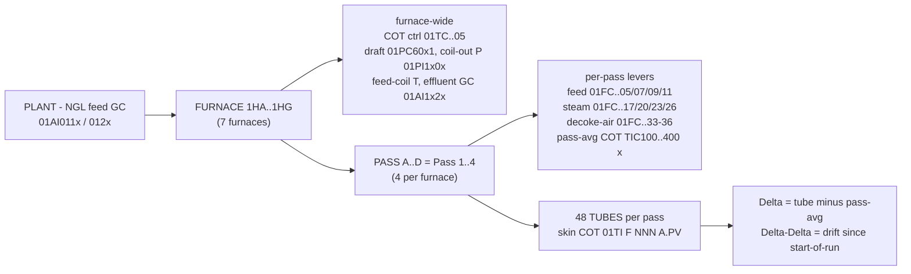

# olefinesse — Delta-Delta furnace-health research

R&D for the Indorama / KBR olefins engagement: data validation and model
development around **Delta-Delta**, the run-normalised tube-skin-temperature
drift operators use as the cracking-furnace health / coking signal.

The headline KPI is ethylene yield per ton of feed. The route to it runs through
the seven cracking furnaces (1HA–1HG). Delta-Delta is the operational observable
of furnace coking that bounds severity, throughput and run length; forecasting it
is the project's first deliverable (a forecaster + what-if tool), with yield
optimisation as a later phase constrained by the forecast. Background docs are in
[`context/`](context/); the argument is summarised in
[`docs/RESEARCH_LOG.md`](docs/RESEARCH_LOG.md).

## Plant topology & tag map

Seven near-identical NGL crackers **1HA–1HG**. Each furnace splits feed into **4
radiant passes (#A–#D = Pass 1–4)**, each independently feed/steam-controlled,
each a bank of **48 radiant tubes** → **192 tubes/furnace**. Every tube has an
outlet skin thermocouple (the COT); **Delta** = a tube's COT minus its **pass
average**, **Delta-Delta** = that deviation re-baselined at start-of-run — the
coking/health signal operators decoke on.



**Key tag conventions** (full detail in [`docs/data_dictionary.md`](docs/data_dictionary.md)):

| signal | tag pattern | mapping |
|---|---|---|
| **tube skin COT** (ΔΔ source) | `01TI{F}{NNN}A.PV` | `F` = furnace digit 1→1HA … 7→1HG; `NNN` = tube **001–192** (often **blank description** — key on the ID). Pass = `⌈NNN/48⌉`: **1–48 A · 49–96 B · 97–144 C · 145–192 D** |
| pass-average COT (DCS) | `TIC{100/200/300/400}{A-G}` | 100/200/300/400 = Pass A/B/C/D; trailing letter = furnace |
| HC feed / pass | `01FC..05/07/09/11` | `#A/#B/#C/#D`; furnace from `H1<x> FD #<p> PASS` |
| dilution steam / pass | `01FC..17/20/23/26` | `H1<x> DS #<p>` |
| decoke air / pass | `01FC..33-36` | `FUR <x> PASS<p> DECOKE AIR` |
| furnace COT controller | `01TC{08..14}05.PV` | block→furnace (08→A … 14→G) |
| coil-outlet pressure | `01PI1x0x.PV` | `EFFL FM 1-E-15/16<x>` |
| convection draft | `01PC60x1.PV` | `H1<x> CONV DRAFT` |
| NGL feed GC (plant) | `01AI011x/012x.PV` | common feed, `furnace="PLANT"` |
| effluent GC (yield) | `01AI1x2x.PV` | `1-H-1<x>` species; A–F only |

All 192 tube COTs/furnace carry ~1/min data from **2025-02**; process drivers and an
8-tube `BANK…PQE` proxy reach back to **2019**.

## Repository layout

```
olefins_ddf/            the package (run with `python -m olefins_ddf` from repo root)
  config.py             cluster / catalog / furnace topology
  catalog.py            discover & label furnace tags from the historian metadata
  io_events.py          load tag history from the 6.6 B-row events table (databricks-connect)
  runs.py               run / decoke segmentation (feed-cut based)
  deltadelta.py         Delta, Delta-Delta, health indicators, coking rate
  features.py           unified per-furnace feature matrix + per-run summary
  correlations.py       correlation matrix, driver→target ranking, lagged x-corr
  plots.py              all figures
  cli.py                `python -m olefins_ddf {furnace|fleet|coverage}`
docs/                   methodology, data dictionary, RESEARCH LOG (persistent memory)
output/                 generated figures + tables (gitignored)
context/                source PDFs / spreadsheet / approach notes
```

## Quickstart

Run from the repo root (needs `databricks-connect`, `pandas`, `matplotlib`,
`pyarrow`; no install step). Set `DDF_CLUSTER_ID` if the research cluster changed.

```bash
# one furnace: Delta-Delta + correlation figure set + feature matrix
python -m olefins_ddf furnace --furnace 1HA

# all seven: fleet health ranking, run-length distribution & timeline
python -m olefins_ddf fleet

# historian data-depth report (samples/year/role)
python -m olefins_ddf coverage --furnace 1HA

# reconstruct from the 8-tube proxy back to 2019 instead of dense 2025+ TCs
python -m olefins_ddf furnace --furnace 1HA --long-history --start 2019-01-01
```

If the research cluster id has changed: `databricks clusters list`, then set
`DDF_CLUSTER_ID`.

## Key findings so far

- **Delta-Delta reconstructs cleanly** from raw per-tube skin TCs; each run resets
  to ~0 at decoke then tubes drift apart — the coking signal.
- **Runs are ~17–25 days, not a clockwork 25** (see `output/run_lengths.png`).
- **7 years of driver history (2019+)**; dense tube TCs only from 2025-02, with an
  8-tube proxy extending Delta-Delta back to 2019.
- **Coking drivers are textbook:** furnace health worsens with run age, heavier
  feed (C5+) and severity (COT), and improves with steam dilution.
- **Topology is furnace → 4 passes (#A–#D) → 48 tubes/pass (192/furnace).**
  Ground-truth-confirmed from the context docs; feed and steam are controlled *per
  pass* while Delta-Delta is *per tube* (deviation from pass average), so the
  toolkit carries a `pass` label and per-pass levers/health
  (`*_06_pass_health.png`). All 192 tubes/furnace (48/pass) are available with
  ~1/min data from 2025-02. See [`docs/data_dictionary.md`](docs/data_dictionary.md) —
  *Furnace topology*.

See [`docs/methodology.md`](docs/methodology.md) and
[`docs/data_dictionary.md`](docs/data_dictionary.md) for detail.
